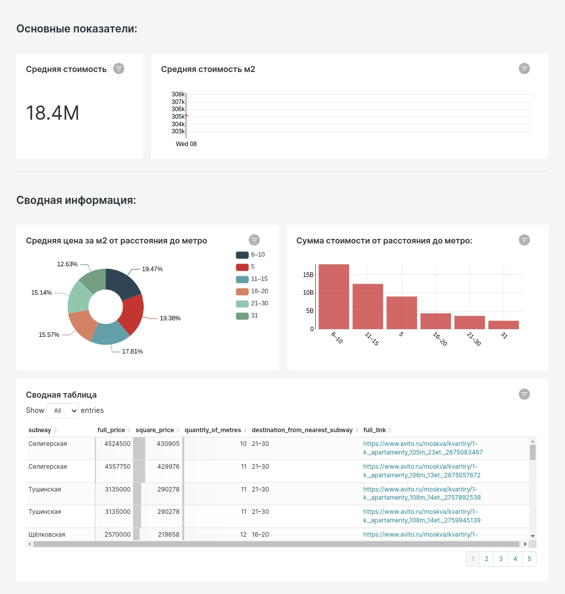

### Main idea of the project:

- In today's world, it's very hard to find an apartment to buy. Most often, we use websites like "Avito", "DomKlik", and others, but sometimes you want to see some good deals in your feed in the morning, like in Telegram. That's exactly why I made this project :)
I always wanted to have a bot in my Telegram that sends me good apartment deals. I had a few reasons for this:
  - Everything is in your favourite messenger;
  - You instantly get the best deals;
  - You can put emojis on the listings you like.
- To me, all this sounds great, so now about the project.
- The channel where the apartments will be posted is [here](https://t.me/moscow_flats_bot) :)

### Main technologies:

- Docker:
  - docker-compose;
  - Superset,
  - Clickhouse (Database),
  - Airflow.
- Python:
  - apache-airflow and other components;
  - beautifulsoup4;
  - clickhouse-driver;
  - hyper;
  - pandas;
  - telegram and other components;
  - emoji (can’t go without it) :)
- Git and basic command line knowledge.

More about versions and library components can be found in the requirements.txt file.

### Project steps:

Initial requirements:
- Everything in the instructions is adapted only for Debian-based machines.
- Ideally, you should be familiar with the technologies listed above.

1. First, let's check if you have git and Docker. To do this, run:
   - For Docker:
     ```docker ps```
   - For git:
     ```git --version```
   If all is good, continue following the manual. If you get an error, you can Google the error or try reinstalling git and Docker:
      - [Docker Docs](https://docs.docker.com/engine/install/ubuntu/);
      - [Docker Install Guide](https://www.digitalocean.com/community/tutorials/how-to-install-and-use-docker-on-ubuntu-20-04-ru);
      - [Git Install Guide](https://www.digitalocean.com/community/tutorials/how-to-install-git-on-ubuntu-20-04).

2. Now let's launch Superset and Clickhouse:
   1. First, create a volume to store our apartment data:
      - ```docker volume create your_volume_name```
   2. Then create a network for Superset and Clickhouse so they can communicate. More details [here](https://www.youtube.com/watch?v=bKFMS5C4CG0). To do this:
      - ```docker network create your_network_name```
   3. Next, let's run our Superset container. More details [here](https://hub.docker.com/r/apache/superset), but for now just run:
      - ```docker run -d --net=your_network_name -p your_pc_port:8088 --name superset apache/superset```

      A few notes:

      - ```--net=your_network_name``` — network name for Superset container;
      - ```-p your_pc_port:8088``` — left is your host port, right is container port;
      - ```--name superset``` — set a name for the container;
      - Then we specify the image.

   4. Now let’s create a superuser in Superset using this command:
      ``` 
        docker exec -it superset superset fab create-admin \
              --username your_username \
              --firstname Superset \ 
              --lastname Admin \ 
              --email admin@superset.com  \
              --password your_password \
      ```
   5. Then apply migrations and initialize Superset:
      - ```docker exec -it superset superset db upgrade```;
      - ```docker exec -it superset superset init```.
   6. Done with Superset for now, let’s set up the database — Clickhouse:
      - ```
        docker run -d\
        --name clickhouse\
        --net=your_network_name\
         -v your_volume_name:/var/lib/clickhouse\
         -p your_pc_port:9000\
          yandex/clickhouse-server
        ```
      A few notes:
      - ```-v your_volume_name:/var/lib/clickhouse``` — left is your volume name, right is the directory in the container being tracked.

   7. The last step is connecting Clickhouse to Superset. Out of the box, it's not supported, but this library can help: [info](https://superset.apache.org/docs/databases/clickhouse/). Install it with:
      - ```docker exec superset pip install clickhouse-sqlalchemy```
        
3. Now you need to clone the repo with my code, custom Airflow, and the requirements file. Use this command:  
   - ```git clone link_to_repository```
4. Next, build the image for our custom Airflow:
   - ```docker build . --tag your_custom_airflow:latest```
   More about Docker build [here](https://docs.docker.com/engine/reference/commandline/build/).
5. Airflow consists of multiple services, and to deploy them together, use docker-compose. To install it:
   - [Docker-compose Docs](https://docs.docker.com/compose/install/);
   - [Guide](https://www.digitalocean.com/community/tutorials/how-to-install-and-use-docker-compose-on-ubuntu-20-04).
6. After installing, download the Airflow `docker-compose.yaml`. A small guide is [here](https://airflow.apache.org/docs/apache-airflow/2.5.1/docker-compose.yaml);
7. After downloading and creating the needed directories, bring up the services:
   - ```docker-compose up```
8. After starting, a default network called airflow_default is created. But Clickhouse and Superset are in a different network, so connect all Airflow containers to your custom network:
   - ```docker network connect your_network_name your_container_name``` — more info [here](https://docs.docker.com/engine/reference/commandline/network_connect/).
9. You’ll notice variables in my script that only Airflow sees. You need to fill them out, too:
    - AIRFLOW_OWNER — name of the DAG owner;
    - CLICKHOUSE_HOST — IP of Clickhouse;
    - TG_TOKEN_AVITO — bot token;
    - CHAT_ID_MOSCOW_FLATS — chat ID;
    - MAIL_TO_REPORT — email for reports.

Once all steps are done, the DAG will start working successfully :)

And since I love data viz and tracking Moscow apartment prices is interesting, I built a dashboard that looks like this:



### Additional materials:

- Materials used:
     1. About Xcom in Airflow: [Video](https://www.youtube.com/watch?v=8veO7-SN5ZY);
     2. Creating a custom Airflow image: [Video](https://www.youtube.com/watch?v=0UepvC9X4HY&t=165s);

- Extra courses:
     1. Since I used Docker a lot, I highly recommend this course, however, all of them are in Russia:
        - [Docker Course](https://karpov.courses/docker);
     2. Also recommend this parsing course:
        - [Parsing Course](https://stepik.org/course/104774/info);
     3. If you want to explore your data, you’ll need SQL. I recommend:
        - [SQL Course](https://karpov.courses/simulator-sql).
